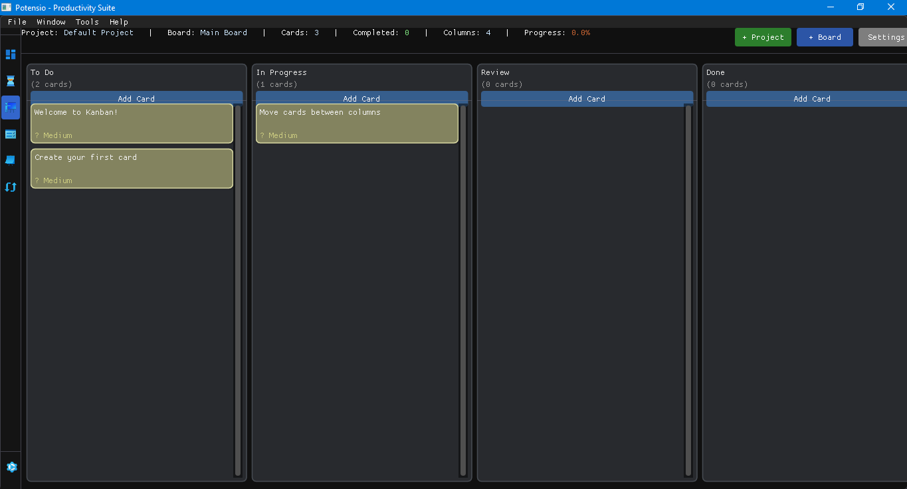

# Potensio

Potensio is a lightweight all-in-one desktop productivity suite designed to keep things fast, simple, and efficient. It provides six core modules: File Staging, Pomodoro Timer, Kanban, To-Do, Clipboard Manager, and Image/PDF Converter & Compressor. Unlike most cross-platform apps, Potensio runs natively without relying on heavy browser engines.



## Tech Stack & Libraries

1. C++17
2. Dear ImGui
3. STB Image
4. SQLite (3.50.4)
5. CMake

## How to Build

Currently, Potensio only supports Windows, as the GUI is implemented with raw WGL. Cross-platform support is possible in the future, but development is currently focused on Windows.

### Windows (Current Support)

1. Create a build directory and move into it
2. Run the following commands (or use Visual Studio directly):

```
cmake .. -G "Visual Studio 17 2022" -A x64
cmake --build . --config Debug
```

## Roadmap

See TODO.md

## Credits

Project initiated by ([Alviansyah Maulana Iskandar](https://github.com/alviansm)).
